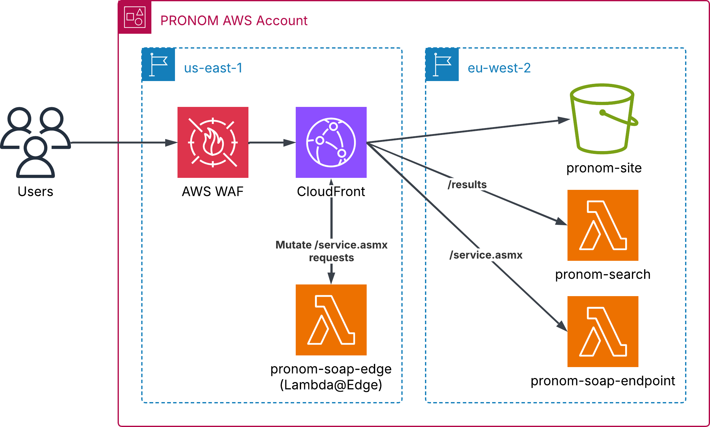

[](https://opensource.org/licenses/MIT)

# PRONOM Website

This contains the code to generate the [PRONOM website].

The website is hosted in AWS, using serverless technologies. Most of the website is static content, refreshed when a new release is made. To support search and the legacy SOAP API for DROID, there are a small number of AWS Lambda Functions.

The website uses aggressive caching to reduce cost and request latency. All static content is cached in addition to search results.



## Build scripts

The static content and search index are generated at build time using the data authored in [nationalarchives/pronom]. The transformations for this are completed as part of the GitHub Actions pipeline using the Python scripts in [`.github/scripts/`](/.github/scripts/).

### generate_index_file.py

This takes a location on disk of the [nationalarchives/pronom] repository as an argument.
It parses all of the JSON files in the `signatures/fmt` and `signatures/x-fmt` directories and adds the name, puid and file extension to a SQLite database.

The SQLite database is built into the Search Lambda code package.

### generate_version_file.py

This generates the XML response from the SOAP API for `getSignatureFileVersionV1` operations. This XML file is built into the SOAP Lambda code package.

### generate_pages.py

This generates the static HTML for the site, using Jinja templates from [`lambdas/templates/`](/lambdas/templates/) and the file format and actor JSON data from a local checkout of the [nationalarchives/pronom] repository (passed as the first argument).

It writes the home, accessibility, error and signature list pages, a detail page for each PUID, and a page for each actor into the `site/` directory. During a release, the script is run inside the nginx container so the rendered pages are served directly by nginx and synced to S3 by `release.sh`.

### release.sh

This is a helper script for the release process. It orchestrates a full release. It:

1. Builds the Docker services and copies the generated static HTML from nginx.
2. Runs `generate_index_file.py` and copies the resulting search index out of the container.
3. Syncs the static assets to the S3 bucket, setting correct `Content-Type` headers for CSS, JavaScript, HTML and font files.
4. Determines the latest PRONOM signature file version from S3 and runs `generate_version_file.py`.
5. Packages the Search and SOAP Lambda Functions into zip archives.
6. Runs `terraform apply` to deploy the infrastructure and Lambda packages.
7. Creates a CloudFront invalidation to purge the CDN cache.

The script requires an environment name as its first argument and expects the `ACCOUNT_NUMBER` and `REGION` environment variables to be set, as well as credentials to the AWS account.

## Lambda code

In the `lambdas/` directory, there are two AWS Lambda Functions. A third is defined in [`/terraform/lambda/`](./terraform/lambda/).

### Results/Search

This processes search requests and renders the results. The search index SQLite database is built into the Lambda code package.

### SOAP

> [!WARNING]
> The SOAP API is a legacy feature and will be removed in future.

This Lambda hosts the SOAP API used by DROID to retrieve PRONOM signatures. It has 2 operations

- `getSignatureFileV1` returns the latest DROID_SignatureFile, this XML file is built into the Lambda code package.
- `getSignatureFileVersionV1` returns the version XML generated by `generate_version_file.py` and built into the Lambda code package.

Requests to this Lambda Function are mutated by the [`pronom-soap-edge`](./terraform/lambda/index.mjs) Lambda@Edge Function to add a `x-amz-content-sha256` header. This is required to enable CloudFront to invoke the Lambda Function using a Function URL with IAM Authentication.

## Developing PRONOM Website

### Running locally

Run `docker compose up -d --build` to build the service and start the nginx and Flask applications.

The Flask app is a single route for the search results page. It passes the local request to the lambda code to handle.

The service will be available at http://localhost:8081.

### Tests

There are two suites of tests.

#### Lambda tests

These are python unittest tests in the `lambdas/test` directory.

```bash
python -m unittest discover -s lambdas/test
```

#### End-to-end tests

These are [Cypress](https://www.cypress.io/) tests which test the behaviour of a local copy of the site. The site must be running locally before these are run.

```bash
npm --prefix tests t
```

### Infrastructure

The infrastructure is managed by Terraform within the `terraform` directory.

The Route53 Hosted Zone has been created manually and is not managed by Terraform. This is to mitigate the risk of a subdomain takeover if the Terraform deployment was destroyed. The `hosted_zone_id` is provided as a variable.

[nationalarchives/pronom]: https://github.com/nationalarchives/pronom
[PRONOM website]: https://pronom.nationalarchives.gov.uk/
